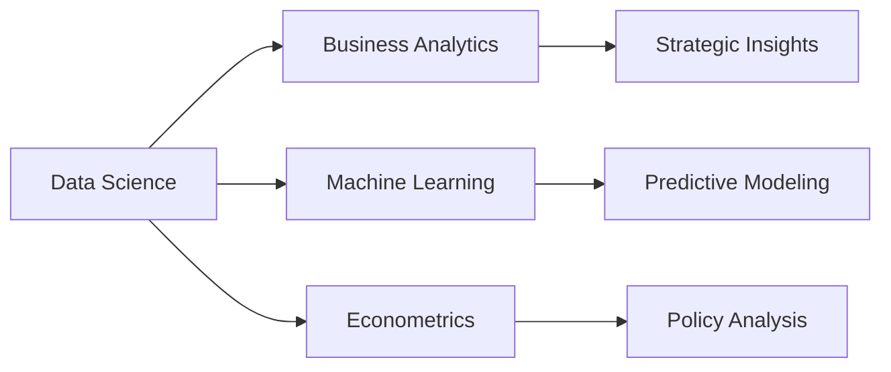

# Hi there, I'm Vivian Yin 👋

<div align="center">

  [](https://linkedin.com/in/yinyueyuan)
  [](mailto:yinyueyuan999@gmail.com)
  [](https://github.com/yinyueyuan) 
</div>

## 🎓 About Me

I'm a **Bachelor of Economics** student at **Minzu University of China** with a passion for data-driven insights and quantitative analysis. Currently maintaining a **3.7/4.0 GPA** (Advanced GPA: 3.85/4.0), I combine economic theory with cutting-edge data science techniques to solve complex business problems.

```python
class VivianYin:
    def __init__(self):
        self.name = "Yueyuan (Vivian) Yin"
        self.education = "Minzu University of China | Economics"
        self.location = "Beijing, China"
        self.interests = ["Data Analytics", "Machine Learning", "Econometrics", "Business Intelligence"]
        self.current_focus = "Leveraging AI/ML for economic modeling and business optimization"
```

## 🛠️ Tech Stack & Tools

<div align="center">

| Data Analysis & ML | Database & BI | Statistical Tools | Others |
| :---: | :---: | :---: | :---: |
|  |  |  |  |
|  |  |  |  |
|  |  |  |  |

</div>

## 💼 Professional Experience

### 🚀 Data Science & Analytics Journey

#### **ByteDance** | *Business Analytics Intern*

* Designed a **decision-tree model** identifying high ROI influencer-product combinations, driving **+30% new merchants** and **+22% sales**.
* Conducted **A/B testing** for couponing strategies, improving redemption rates by **18%**.
* Built tiered influencer segmentation frameworks and integrated **Hive with Power BI** for real-time dashboards.

#### **Clarivate Analytics** | *Data Analytics Intern*

* Automated data pipelines for **10M+ patent records**, improving accuracy to **98%** and cutting manual time by **75%**.
* Developed multi-dimensional dashboards to monitor KPIs across **100+ global datasets**.

#### **AsiaInfo Technologies** | *Project Management Technical Intern*

* Optimized data tracking pipelines and built behavior monitoring models for anomaly detection.

## 🔬 Research & Projects

### 📊 Featured Research Projects

#### Carbon Emission Trading and Corporate Investment Efficiency

* Applied **Difference-in-Differences** models to estimate policy effects

* Developed **XGBoost** prediction models for 5-10 year investment efficiency forecasting
* Technologies: `Python`, `Stata`, `Machine Learning`

#### Econometric Modeling on Ethnic Culture Transmission

* Conducted **100+ field interviews** and on-site research

* Applied **Structural Equation Modeling (SEM)** for heritage transmission analysis
* Technologies: `Python`, `SPSS`, `Statistical Modeling`

#### Quantitative Marketing Analysis - Amazon Canada

* Analyzed **5,000+ product records** using FM modeling

* Developed data-driven pricing strategies for market optimization
* Technologies: `Python`, `Data Mining`, `Business Intelligence`

## 📈 GitHub Analytics

<div align="center">
  
  <br/>
  
</div>

## 🏆 Achievements & Certifications

<details>
<summary><b>🎯 Click to view all achievements</b></summary>

* 🥇 **Merit-based Scholarship** (Top 5%)
* 🥈 **2nd Prize** - National Business Elite Competition
* 🥉 **3rd Prize** - Beijing Global AI Algorithm Competition
* 🎓 **Cambridge University Exchange Program** - Excellent Participant
* 📚 **Coursera Certifications**:
  * Machine Learning Specialization
  * Mathematics for Machine Learning (Linear Algebra)
  * Advanced Data Science

</details>

## 🌟 Leadership & Extracurriculars

* **👥 Team Leader** - MUC Volunteer Education Team (10+ charity teaching activities)
* **🎓 Class President** - 3+ years of leadership experience
* **💻 Department Leader** - Security Association IT Department
* **🎵 Creative Member** - Campus Choir Publicity Department

## 📊 Current Focus Areas

<div align="center">



</div>

## 💡 Featured Skills Matrix

| Domain | Technologies | Proficiency |
|--------|-------------|-------------|
| **Data Analysis** | Python, SQL, Stata, SPSS | ████████████ 95% |
| **Business Intelligence** | Power BI, Hive, Excel VBA | ████████████ 90% |
| **Machine Learning** | XGBoost, Decision Trees, SEM | ███████████░ 85% |
| **Statistical Modeling** | Econometrics, DiD, Time Series | ████████████ 90% |
| **Project Management** | Jira, Wiki, Agile | ███████████░ 85% |

## 🌐 Connect With Me

<div align="center">

  [](https://github.com/yinyueyuan)
  [](mailto:yinyueyuan999@gmail.com)

  ---

  <i>💬 "Transforming data into actionable insights, one algorithm at a time."</i>

  
  <!-- "margin-right: 0px" -->
  <span>&nbsp;&nbsp;&nbsp;&nbsp;</span>
  
  <span>&nbsp;&nbsp;&nbsp;&nbsp;</span>
  

</div>

---

<div align="center">
  <b>Thanks for visiting my profile! Feel free to explore my repositories and connect!</b>

  
</div>
